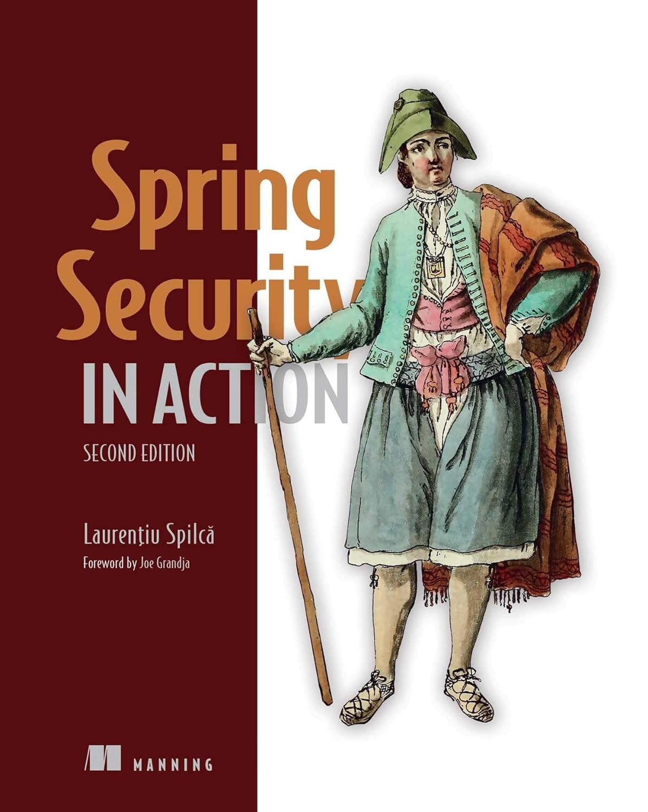

# Spring Security in Action, Second Edition
**By [Laurențiu Spilcă](https://twitter.com/laurspilca), [Joe Grandja](https://twitter.com/joe_grandja)

 

[Amazon](https://www.amazon.com/Spring-Security-Action-Second-Laurentiu/dp/1633437973) | [Manning](https://www.manning.com/books/spring-security-in-action-second-edition) | [YouTube](https://t.co/4Or4P12LH2?amp=1) | [Books](https://laurspilca.com/books/) | [livebook](https://livebook.manning.com/book/spring-security-in-action-second-edition/) 

## PART 1. FIRST STEPS
### 1 SECURITY TODAY
### 2 [HELLO SPRING SECURITY](chapter02)
## PART 2. IMPLEMENTATION
### 3 [MANAGING USERS](chapter03)
### 4 DEALING WITH PASSWORDS
### 5 [IMPLEMENTING AUTHENTICATION](chapter05)
### 6 [HANDS-ON: A SMALL SECURED WEB APPLICATION](chapter06)
### 7 [CONFIGURING AUTHORIZATION: RESTRICTING ACCESS](chapter07)
### 8 [CONFIGURING AUTHORIZATION: APPLYING RESTRICTIONS](chapter08)
### 9 [IMPLEMENTING FILTERS](chapter09)
### 10 [APPLYING CSRF PROTECTION AND CORS](chapter10)
### 11 [HANDS-ON: A SEPARATION OF RESPONSIBILITIES](chapter11)
### 12 [HOW DOES OAUTH 2 WORK?](chapter12)
### 13 [OAUTH 2: IMPLEMENTING THE AUTHORIZATION SERVER](chapter13)
### 14 [OAUTH 2: IMPLEMENTING THE RESOURCE SERVER](chapter14)
### 15 [OAUTH 2: USING JWT AND CRYPTOGRAPHIC SIGNATURES](chapter15)
### 16 [GLOBAL METHOD SECURITY: PRE- AND POSTAUTHORIZATIONS](chapter16)
### 17 [GLOBAL METHOD SECURITY: PRE- AND POSTFILTERING](chapter17)
### 18 [HANDS-ON: AN OAUTH 2 APPLICATION](chapter18)
### 19 [SPRING SECURITY FOR REACTIVE APPS](chapter19)
### 20 SPRING SECURITY TESTING
## APPENDIXES
### APPENDIX A: CREATING A SPRING BOOT PROJECT
